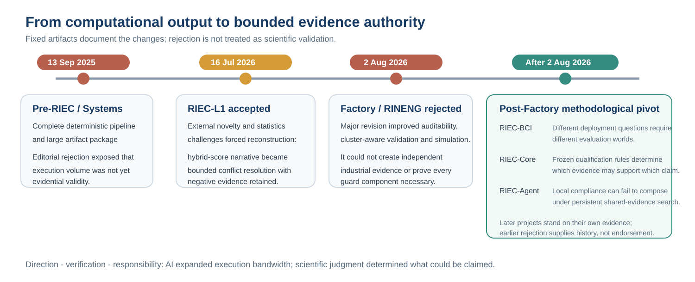

# RIEC research portfolio

This repository is the public map of Jincheng Li's RIEC research programme. It explains how the projects relate, what each project demonstrates, where each claim stops, and how failed submissions and external criticism changed the programme.

RIEC began with a model-selection problem: several reasonable analysis procedures can recommend different actions from the same evidence. The programme then moved from finite candidate libraries to evaluation design, protocol-to-claim governance and, finally, distributed adaptive search by multiple AI agents.

## A documented development path

The programme did not begin as a mature governance framework. A September
2025 pre-RIEC submission demonstrated that an AI-assisted workflow could
rapidly produce an extensive deterministic pipeline, manuscript and
supplementary package while still lacking stable metric definitions,
independent validation and a defensible claim boundary. It was rejected at
editorial screening. The later Factory manuscript became more auditable and
survived into substantial revision, but its August 2026 rejection showed that
documentation and simulation could not replace independent external evidence.

RIEC-BCI, RIEC-Core and RIEC-Agent were developed after that Factory decision.
They respectively made the evaluation world explicit, separated frozen
protocol-to-claim authority from performance, and tested whether local
compliance composes under distributed adaptive search.

The public-safe evidence trail is in
[`PEER_REVIEW_AND_REVISION_HISTORY.md`](PEER_REVIEW_AND_REVISION_HISTORY.md)
and [`review_history/`](review_history/README.md). Raw editorial correspondence
is not redistributed.

## Four stages

| Stage | Research object | Central question | Public artifact |
|---|---|---|---|
| RIEC-L1 | finite candidate library | How can conflicting but reasonable selection criteria be turned into an auditable engineering decision? | [paper](https://doi.org/10.1016/j.array.2026.101097), [repository](https://github.com/lijincheng494gmail/riec-l1-conflict-resolution) |
| RIEC-BCI | motor-imagery EEG evaluation | How does the deployment world change apparent pipeline performance, ranking and recommendation? | journal manuscript submitted after transfer; preprint pending; [repository](https://github.com/lijincheng494gmail/riec-bci) |
| RIEC-Core | protocol, evidence, action and claim | Which qualified evidence is allowed to support which bounded scientific claim after the rules are frozen? | [preprint](https://doi.org/10.2139/ssrn.7264499), [repository](https://github.com/lijincheng494gmail/riec-core) |
| RIEC-Agent | persistent multi-agent evidence use | Why can locally compliant agents still lose global error control, and can persistent accounting improve the safety-discovery trade-off? | [preprint](https://doi.org/10.2139/ssrn.7298738), [repository](https://github.com/lijincheng494gmail/riec-agent) |

## Cross-domain development applications

Before Core was frozen, several public application manuscripts exposed distinct protocol and evidence problems. They are part of the development history rather than independent lockbox validations of the final Core:

- [Auditable Evaluation in Peptide–Protein Docking](https://doi.org/10.2139/ssrn.7170499);
- [A Protocol-Sensitivity Indicator Framework for Reusable Sustainability Evidence Tables](https://doi.org/10.2139/ssrn.6517459);
- [An Auditable Engineering Informatics Workflow for Plant-Level Digitalization Diagnosis](https://doi.org/10.2139/ssrn.6478802).

## What unifies the programme

The common object is not a universal predictor. It is the governance chain from an analysis protocol to evidence authority, action and a bounded claim. Across the projects, strong numerical performance is not allowed to compensate for leakage, duplicated evidence, unit mismatch, unsupported deployment or an undefined estimand.

## What this portfolio does not claim

- It does not claim that one model generalizes from engineering to neuroscience.
- It does not claim that every RIEC component is necessary in every setting.
- It does not claim clinical readiness, neural-mechanistic discovery or universal AI-governance validity.
- Computational neuroscience is the intended doctoral training direction, not a completed domain identity.

See [`PROJECT_BOUNDARIES.md`](PROJECT_BOUNDARIES.md), [`PUBLICATION_STATUS.md`](PUBLICATION_STATUS.md), [`PEER_REVIEW_AND_REVISION_HISTORY.md`](PEER_REVIEW_AND_REVISION_HISTORY.md), [`review_history/LESSON_TO_DESIGN_MAP.md`](review_history/LESSON_TO_DESIGN_MAP.md) and [`AI_AND_AUTHOR_RESPONSIBILITY.md`](AI_AND_AUTHOR_RESPONSIBILITY.md) for the explicit boundaries, external-critique history, design lineage and author-responsibility statement.

Author identifier: [ORCID 0009-0001-3100-5272](https://orcid.org/0009-0001-3100-5272).
