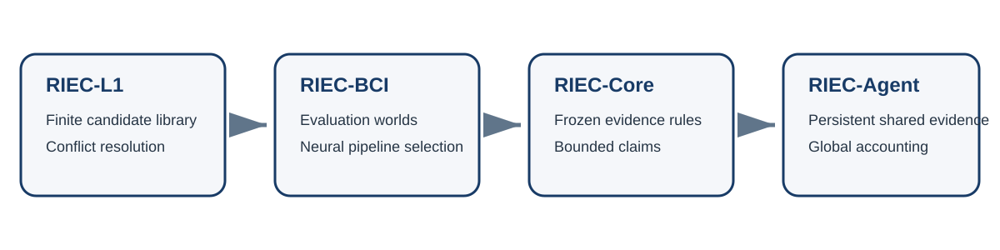

# RIEC research portfolio

This repository is the public map of Jincheng Li's RIEC research programme. It explains how the projects relate, what each project demonstrates, and where each claim stops.

RIEC began with a model-selection problem: several reasonable analysis procedures can recommend different actions from the same evidence. The programme then moved from finite candidate libraries to evaluation design, protocol-to-claim governance and, finally, distributed adaptive search by multiple AI agents.

## Four stages

| Stage | Research object | Central question | Public artifact |
|---|---|---|---|
| RIEC-L1 | finite candidate library | How can conflicting but reasonable selection criteria be turned into an auditable engineering decision? | [paper](https://doi.org/10.1016/j.array.2026.101097), [repository](https://github.com/lijincheng494gmail/riec-l1-conflict-resolution) |
| RIEC-BCI | motor-imagery EEG evaluation | How does the deployment world change apparent pipeline performance, ranking and recommendation? | [repository](https://github.com/lijincheng494gmail/riec-bci) |
| RIEC-Core | protocol, evidence, action and claim | Which qualified evidence is allowed to support which bounded scientific claim after the rules are frozen? | [preprint](https://doi.org/10.2139/ssrn.7264499), [repository](https://github.com/lijincheng494gmail/riec-core) |
| RIEC-Agent | persistent multi-agent evidence use | Why can locally compliant agents still lose global error control, and can persistent accounting improve the safety-discovery trade-off? | [repository](https://github.com/lijincheng494gmail/riec-agent) |

## What unifies the programme

The common object is not a universal predictor. It is the governance chain from an analysis protocol to evidence authority, action and a bounded claim. Across the projects, strong numerical performance is not allowed to compensate for leakage, duplicated evidence, unit mismatch, unsupported deployment or an undefined estimand.

## What this portfolio does not claim

- It does not claim that one model generalizes from engineering to neuroscience.
- It does not claim that every RIEC component is necessary in every setting.
- It does not claim clinical readiness, neural-mechanistic discovery or universal AI-governance validity.
- Computational neuroscience is the intended doctoral training direction, not a completed domain identity.

See [`PROJECT_BOUNDARIES.md`](PROJECT_BOUNDARIES.md), [`PUBLICATION_STATUS.md`](PUBLICATION_STATUS.md) and [`AI_AND_AUTHOR_RESPONSIBILITY.md`](AI_AND_AUTHOR_RESPONSIBILITY.md) for the explicit boundaries.
